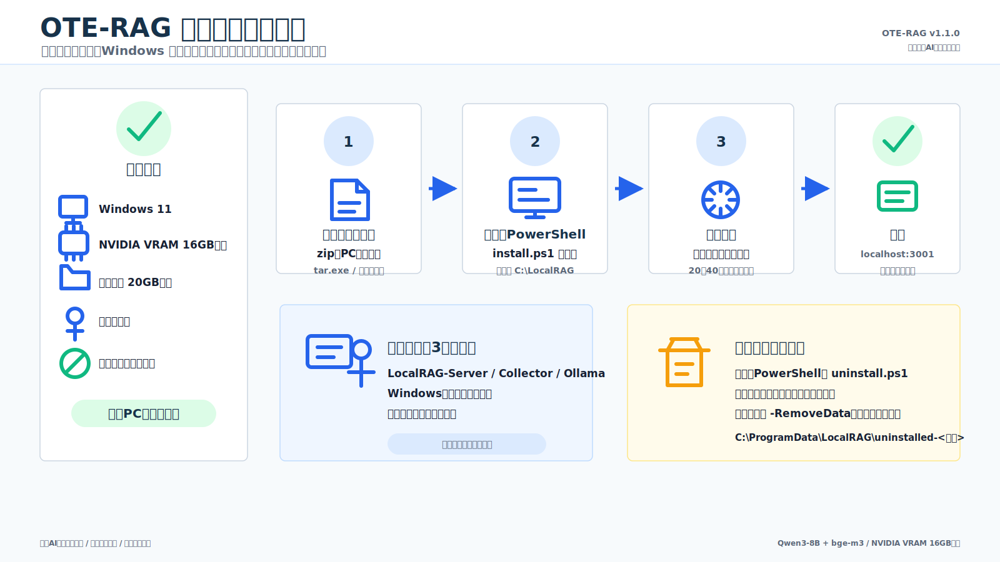
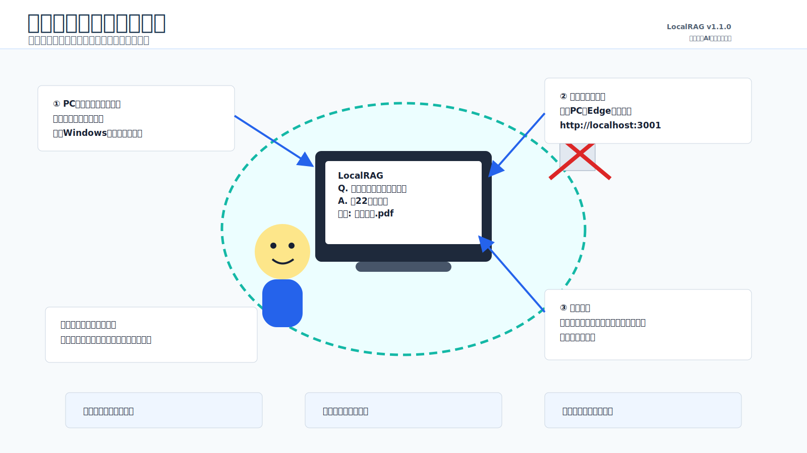
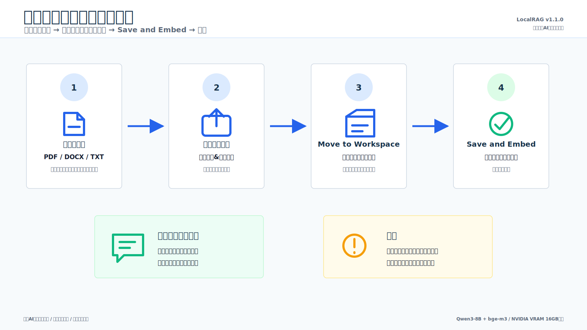
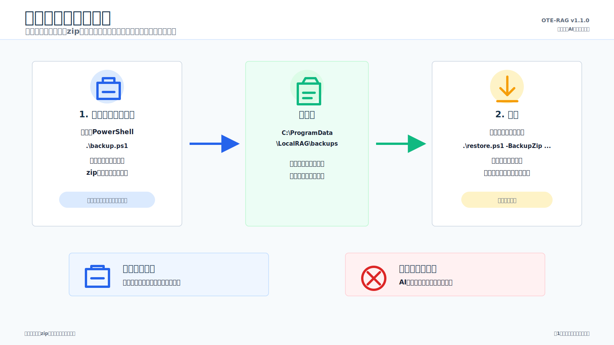
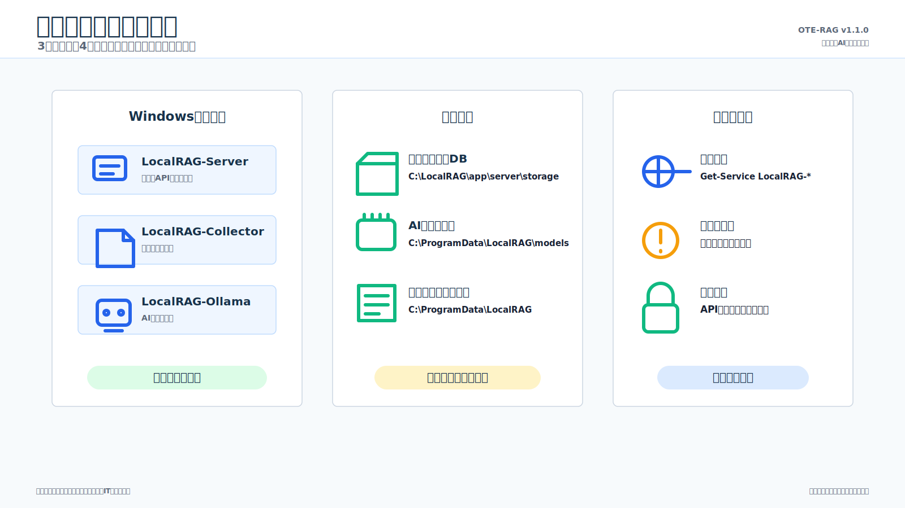
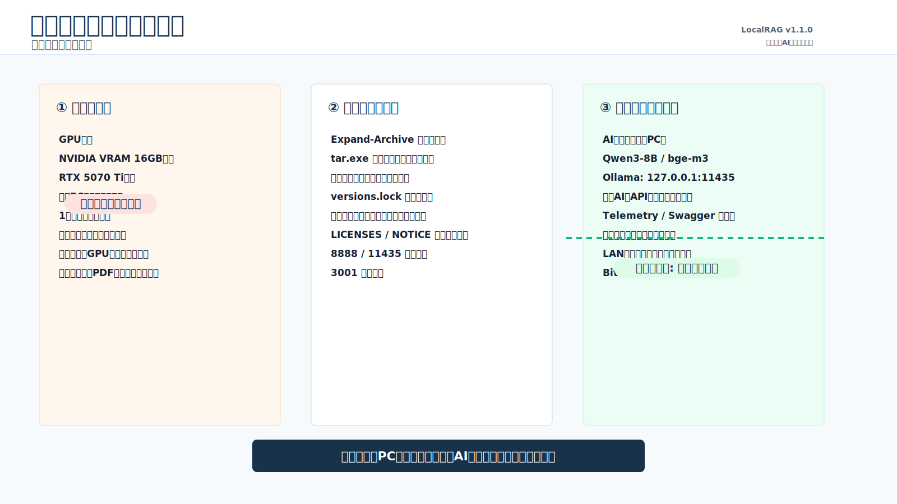

# LocalRAG

LocalRAG は、顧客の Windows PC だけで動く日本語 RAG パッケージです。所内文書をアップロードし、文書に基づく回答と出典を確認できます。クラウド AI に文書や質問を送らないことを前提に、AnythingLLM の fork を Windows native 配布向けに整備しています。

現在の顧客配布ターゲット: **LocalRAG Windows native v1.1.0**  
配布方針: **Windows 11 に直接インストール**。顧客環境に WSL / Docker は不要です。

## まず絵で見る

### インストールとアンインストール



### ふだんの使い方



### 文書を取り込んで質問する



### バックアップと復元



### 日常の管理と保存場所



### 制約と注意事項



## この製品でできること

LocalRAG は、顧客 PC 内の文書を検索対象にして、チャット形式で質問できるようにします。回答には出典を表示し、文書に書かれていない内容は「不明」と答える設計です。

Windows native 版では、次の 3 つの Windows サービスとして動作します。

- `LocalRAG-Server`: 画面、API、回答生成の本体
- `LocalRAG-Collector`: 文書の読み取りと取り込み処理
- `LocalRAG-Ollama`: ローカル AI モデルの実行エンジン

利用者は同じ PC のブラウザで次の URL を開きます。

```text
http://localhost:3001
```

## 重要な前提条件

- OS: Windows 11、または Windows 10 21H2 以降
- GPU: NVIDIA GPU、VRAM 16GB 級
- ディスク: インストール先ドライブに 20GB 以上の空き容量
- 権限: インストール、サービス操作、バックアップ、復元、アンインストールには Windows 管理者権限が必要
- ネットワーク: インストールにも日常利用にもインターネット接続は不要
- ポート: 画面用に `3001`、内部処理用に `8888` と `11435` を使用

既定のインストール先は `C:\LocalRAG` です。モデル、ログ、バックアップは `C:\ProgramData\LocalRAG` 配下に保存されます。

## セキュリティとデータの扱い

LocalRAG はローカル完結を前提にしています。

- 顧客文書、質問、回答、チャット履歴、検索用データは顧客 PC 内に保存します。
- OpenAI / Anthropic / Google Gemini などの外部 AI provider は有効化しません。
- Telemetry、Swagger docs、Web scraping、実行時のモデルダウンロードは無効化します。
- AI 実行エンジンは `127.0.0.1:11435` で待ち受け、PC 内部からのみ使います。
- バックアップ zip には文書と履歴が含まれるため、機密文書と同じ扱いで保管してください。
- `LICENSES/` と `NOTICE` に含まれる OSS / モデルのライセンス表示は削除しないでください。

## インストールの要点

配布物は、モデルを含む大きな zip ファイルです。

```text
LocalRAG-win64-v1.1.0.zip
```

展開には Windows エクスプローラーの「すべて展開」または `tar.exe` を使用してください。PowerShell の `Expand-Archive` はサポート対象外です。

管理者 PowerShell でインストーラを実行します。

```powershell
cd C:\Users\<user>\Downloads\LocalRAG-win64-v1.1.0
powershell.exe -NoProfile -ExecutionPolicy Bypass -File .\install.ps1
```

インストーラは、事前チェック、チェックサム検証、ファイルコピー、環境設定生成、DB 初期化、サービス登録、サービス起動、API 疎通確認までを実行します。

## 日常運用

通常の利用者は、ブラウザで `http://localhost:3001` を開くだけです。Windows 起動時に 3 つのサービスが自動起動します。

管理者向けの主な操作は、インストール先フォルダで実行します。

```powershell
.\start.ps1
.\stop.ps1
.\backup.ps1
.\restore.ps1 -BackupZip <backup.zip>
.\uninstall.ps1
```

バックアップは既定で `C:\ProgramData\LocalRAG\backups` に作成されます。AI モデル本体と実行バイナリは、配布パッケージから復元できるためバックアップ対象外です。

## 現在の検証状況

Windows native v1.1.0 は Round2 管理者検証を通過しています。確認済みの範囲は、tar 展開、install、API ping、API key 生成、PowerShell 5.1 RAG E2E、Windows Service / Session 0 での GPU 認識、backup、stop/start、uninstall、cleanup です。

リリース前の仕上げ確認として、Windows 再起動後の自動復帰と、ネットワークを完全に切断した状態での通し検証が残っています。最新状況は [docs/HANDOFF.md](docs/HANDOFF.md) を参照してください。

## 詳細ドキュメント

- [Windows 顧客向けインストールガイド](docs/customer-windows/INSTALL_GUIDE.md)
- [Windows 顧客向け日常運用ガイド](docs/customer-windows/OPERATIONS_GUIDE.md)
- [Windows 顧客向けセキュリティガイド](docs/customer-windows/SECURITY_GUIDE.md)
- [Windows 顧客向けトラブルシューティング](docs/customer-windows/TROUBLESHOOTING.md)
- [モデルカード](docs/MODEL_CARDS.md)
- [最新ハンドオフ](docs/HANDOFF.md)
- [顧客配布計画](docs/anythingllm_customer_distribution_plan.md)
