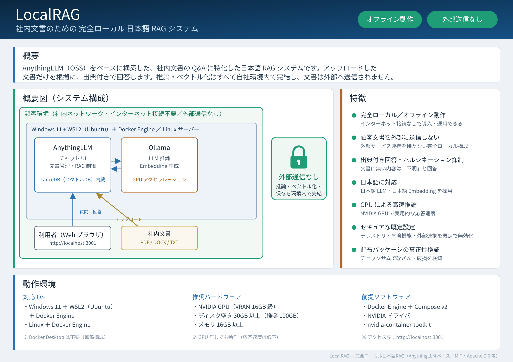

# LocalRAG



> 上図は本製品の概要資料です（概要・概要図・特徴・動作環境）。
> 画像元データ: [`assets/localrag-overview.svg`](./assets/localrag-overview.svg)

社内文書を対象にした、完全ローカル動作の日本語 RAG（Retrieval-Augmented
Generation）アプリケーションです。

## できること

- PDF / DOCX / TXT などの社内文書をアップロードし、内容について
  日本語で質問できます。
- 回答には根拠となった文書（出典）が付きます。
- 文書に書かれていない内容を質問した場合は、推測で答えず「不明」と
  回答するよう既定のプロンプトで制御しています。

## できないこと（意図的な制限）

- インターネット上の外部 LLM（OpenAI、Anthropic、Google Gemini 等）
  は利用できません。バックエンド API 側で拒否されます。
- 文書やチャット内容が外部サービスへ送信されることはありません。
  推論・埋め込み（embedding）は同梱の Ollama コンテナ上でのみ実行
  されます。
- Web 検索・外部データベース接続などの Agent 機能は既定で無効です。

## システム構成

- **AnythingLLM**（本製品向けにカスタムビルドした Docker イメージ）
  ‐ チャット UI・文書管理・ワークスペース管理
- **Ollama**（Docker コンテナ）‐ LLM 推論・embedding をローカル実行
- **LanceDB**（AnythingLLM 内蔵）‐ ベクターデータベース

すべて Docker コンテナとして動作し、インターネット接続なしで
利用できます（初回インストール時のみ配布パッケージからの読み込みが
必要です）。

## 起動 URL

インストール後、ブラウザで以下にアクセスしてください。

```
http://localhost:3001
```

## ドキュメント一覧

- [INSTALL_GUIDE.md](./INSTALL_GUIDE.md) — インストール手順
- [OPERATIONS_GUIDE.md](./OPERATIONS_GUIDE.md) — 起動・停止・バックアップ等の運用
- [SECURITY_GUIDE.md](./SECURITY_GUIDE.md) — セキュリティ方針・外部通信の扱い
- [TROUBLESHOOTING.md](./TROUBLESHOOTING.md) — トラブルシューティング
